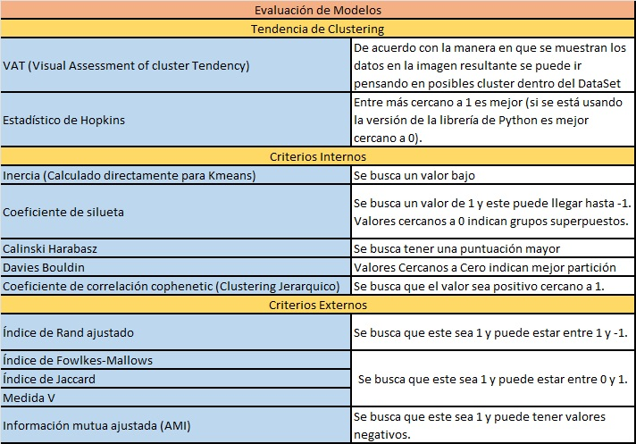

# Final Project: Machine Learning I

## Description:

This project delves into the [Obesity or CVD risk](https://www.kaggle.com/datasets/aravindpcoder/obesity-or-cvd-risk-classifyregressorcluster) dataset from Kaggle. We examine various clustering techniques to determine the most effective one, evaluating them using both internal and external indices.

The algorithms we utilize include:
- KMeans with initialization methods: "KMeans++" and "random".
- DBSCAN.
- MeanShift.
- Spectral Clustering.
- KMeans with adjustment for the number of clusters inherent to the dataset.
- MiniSom.

Additionally, we've compiled a summary of the internal and external indices and identified the target values we aim to achieve.

